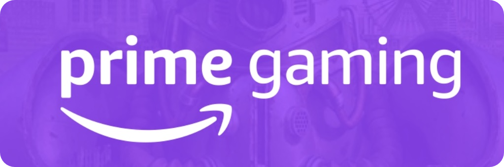
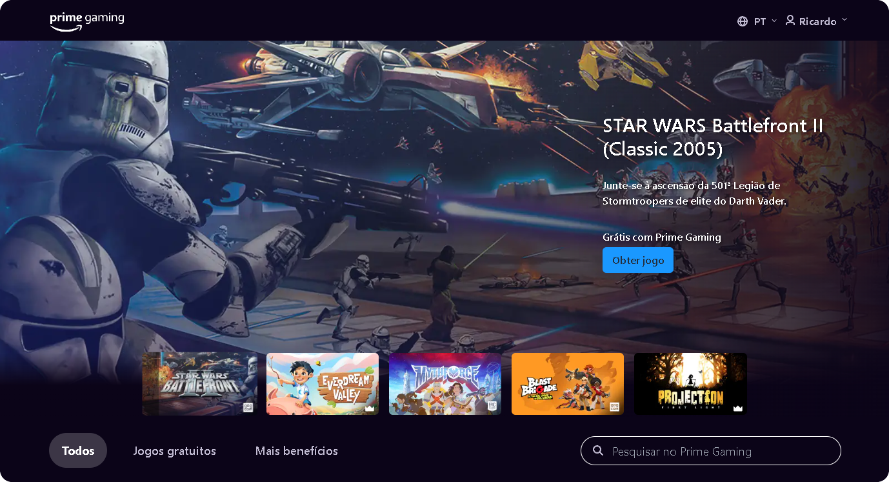

🌍 *[Português](README.md) ∙ [English](README-EN.md)*

<p align="center">
  
</p>

<h1 align="center">Prime Gaming - Clone</h1>

<div align="center">
  <strong>🎮 Explore a simulação de uma plataforma de jogos com Amazon Prime. 👑</strong>
</div>

## 🔭 Visão Geral

Prime Gaming é um clone inspirado no serviço Amazon Prime Gaming, oferecendo uma plataforma onde você pode acessar uma variedade de jogos gratuitos, loot in-game e outros benefícios exclusivos para membros Prime. Ideal para entusiastas de jogos que desejam desfrutar de conteúdo premium mensalmente. **Por favor, note que este é um projeto de frontend e não possui funcionalidades backend reais.**

## 🌟 Funcionalidades

Prime Gaming oferece uma série de recursos projetados para melhorar sua presença online e facilitar o compartilhamento de seus links importantes:

- 🎮 **Jogos Grátis Mensais**: Explore uma seleção fictícia de jogos gratuitos.
- 🎁 **Loot In-Game Exclusivo**: Simule a reivindicação de itens exclusivos, skins, e bônus para seus jogos favoritos.
- 📑 **Filtro de Seção**: Use este recurso para ocultar ou exibir elementos específicos na interface. Ao selecionar uma seção como ‘Jogos Gratuitos’ ou ‘Mais Benefícios’, o filtro oculta todos os outros elementos e exibe apenas o conteúdo relevante para essa seção.
- 📱 **Compatibilidade Multiplataforma**: Acesse seu conteúdo em qualquer dispositivo, seja desktop, tablet ou smartphone.

Cada funcionalidade é projetada pensando na facilidade de uso e na eficiência, permitindo que você se concentre no que é mais importante - criar conteúdo incrível e se conectar com seu público.


<p align="center">
  
</p>

> [!IMPORTANT]
> O Clone do Prime Gaming é um projeto independente e não está afiliado ao Prime Gaming ou qualquer outra empresa. Este projeto foi desenvolvido com o objetivo de ser uma ferramenta educativa, proporcionando um ambiente para aprendizado e demonstração. É importante ressaltar que este projeto é apenas para fins educacionais e não deve ser usado para atividades fraudulentas ou golpes. O autor deste projeto não assume qualquer responsabilidade pelo uso indevido desta aplicação.

## 🔗 Links 

- ✨ Experimente o Prime Gaming aqui: [Demo](https://primegaming-clone.netlify.app/)

## 💻 Tecnologias

- **Vite**: Ambiente de desenvolvimento que proporciona um servidor de desenvolvimento extremamente rápido e eficiente.
- **JavaScript**: Linguagem de programação utilizada para criar interações dinâmicas no cliente.
- **React.js**: Biblioteca JavaScript para construir interfaces de usuário com componentes reutilizáveis e reativos.
- **Tailwind CSS**: Um framework CSS de baixo nível que facilita a criação de designs personalizados através de classes utilitárias pré-definidas.
- **ESLint**: Ferramenta de análise de código estática para identificar padrões problemáticos encontrados no código JavaScript.

## ⚙️ Configuração do Ambiente 

Para executar o projeto localmente em um ambiente de desenvolvimento, certifique-se de ter o Node.js e o npm (ou yarn) instalados. Em seguida, siga estas etapas:

1. Clone o projeto 
   ```
   git clone https://github.com/rwbe/primegaming-clone
   ```
2. Navegue até o diretório do projeto:
   ```
   cd primegaming-clone
   ```
3. Instale as dependências usando npm ou yarn:
   ```
   npm install ou yarn install
   ```
4. Inicie o servidor de desenvolvimento:
   ```
   npm run dev ou yarn dev
   ```
5. Abra a aplicação no seu navegador. Por padrão, ela estará disponível em:
   ```
   http://localhost:5173
   ```

## 🚀 Autor

> Este projeto foi criado por [**Ricardo Willian**](https://github.com/rwbe) como uma alternativa open-source inspirada nas funcionalidades oferecidas pelo Amazon Prime Gaming.

## ⭐️ Suporte

Se você gostou do PrimeGaming e deseja apoiar o projeto, considere deixar uma estrela no repositório do GitHub ou compartilhar nas redes sociais. Além disso, contribuições são sempre bem-vindas! Se você tem sugestões de melhorias, correções ou novas funcionalidades, sinta-se à vontade para fazer um Pull Request ou abrir uma Issue no repositório.

## 📜 Licença

Este projeto é distribuído sob a [Licença MIT](LICENSE), permitindo uso, modificação e distribuição livremente, desde que mantida a mesma licença e reconhecimento dos autores originais.

---
